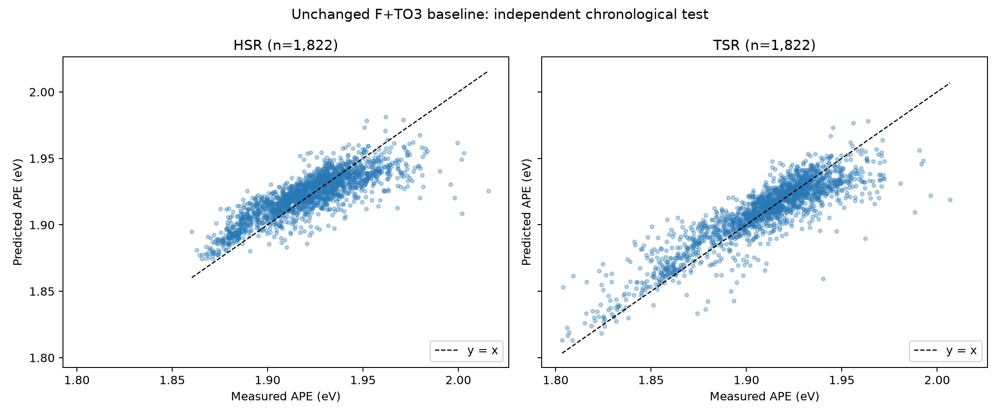
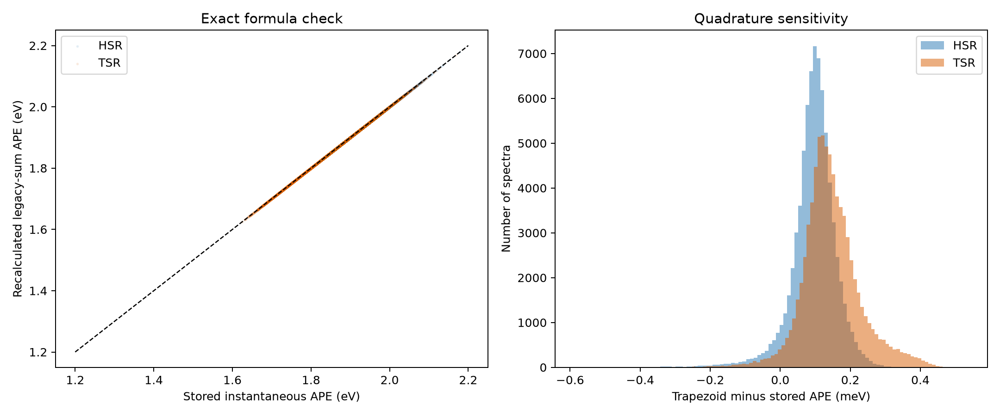

# APE moment comparison — Step 0 baseline and spectral audit

APE直接回帰と、スペクトルの低次元モーメント（S0/S1）を経由したAPE予測を比較する前に、既存モデル・元スペクトル・APEの数値定義・共通評価サンプルを固定した監査です。筑波のHSR（水平面）とTSR（傾斜32°）を対象に、既存のF+TO3 baselineを**変更せず**再実行しました。詳細な方法・結果・問題点は[監査レポート](00_baseline_audit/00_baseline_audit_report.md)に記録しています。

## 結論

**Step 0: PASS。** 既存baselineの独立Test結果をREADMEの表示桁まで再現し、元スペクトルから既存APEを機械精度で再計算できました。後続4モデルに共通の12,163時刻・24,326行（HSR/TSR各12,163行）を確定し、Train／Validation early／Validation calibration／Testからの除外は0行です。

ただし、既存APEは台形積分ではなく1 nm格子の**単純和**で定義されています。また、瞬時APEの時間平均（A）と、時間平均S0/S1から求めた比（B）は一致しません。次のRaw Moment実験では全モデルを同じcohort・同じhourly Aの正解APEで評価し、A/Bを同一視しないことが必須です。

## 既存baselineの再現

一次大気入力はAM、AOD550、omega（TQV）、TO3、TOTANGSTR（Ångström指数）の5変数のみです。[既存のF+TO3リポジトリ](https://github.com/yukichacha0227-stack/ape-hybrid-fixed-beta-mlp)の実装と設定を変更せず、Fixed-beta Ridge → Train OOF beta prediction → residual MLP → 因果的recursive residual rollout → Validation後半だけのsurface-wise affine calibration → 独立時系列Test、という手順を再実行しました。seed 42、時系列70/15/15分割、6時間purge、1/2/3/6時間lagも維持しています。Testは学習・モデル選択・校正に使用していません。

| 独立Test | 件数 | R² | RMSE (meV) | MAE (meV) | MBE = 正解−予測 (meV) |
|---|---:|---:|---:|---:|---:|
| HSR | 1,822 | 0.656702 | 13.841725 | 10.675950 | −1.006297 |
| TSR | 1,822 | 0.779483 | 14.190303 | 10.311606 | −0.481865 |



散布図は独立Testのみを使用し、横軸を正解APE、縦軸を予測APEとしています。高APE側では過小予測が残ります。

## スペクトルとAPEの数値定義

元データは筑波地点301のHSR/TSR日次CSVです。Shift-JIS、350–1700 nmを1 nm刻みで記録し、分光放射照度の単位は`W/m²/μm`です。監査ではAPEと同じ350–1050 nmの701波長を使用し、pickle内の元ファイル・行番号・JST時刻・地点・Remarkとの一致を全採用スペクトルで検証しました（HSR 76,742件、TSR 76,958件）。欠損値`-9999`や非有限値を含む対象波長行は既存のtarget生成段階で除外されています。

S0 = ∫ E(λ)dλ、S1 = ∫ λE(λ)dλ、APE = 1239.84193 × S0/S1 eVです。`E`が`W/m²/μm`、λがnmのため、物理単位のS0/S1ではnm積分値を1000で割ります。台形積分と、元APE生成コードの1 nm単純和を**別々に**算出しています。

| 瞬時APE再計算 | R² | MAE (meV) | 最大絶対差 (meV) |
|---|---:|---:|---:|
| HSR・既存単純和 | 1.000000 | 約1.7×10⁻¹² | 約9.3×10⁻¹² |
| TSR・既存単純和 | 1.000000 | 約1.4×10⁻¹³ | 約6.7×10⁻¹³ |
| HSR・台形積分 | 0.999984 | 0.104 | 0.587 |
| TSR・台形積分 | 0.999987 | 0.150 | 0.536 |



既存hourly targetは「各瞬時APEの算術平均」（A）です。「時間内のS0/S1を平均してから比を取る」（B）との差は、既存単純和規則でもHSR MAE 2.604 meV・最大67.233 meV、TSR MAE 2.772 meV・最大65.622 meVでした。これは台形積分と単純和の差とは別の問題です。

## 共通cohortと収録物

HSR/TSRの同時刻は必ず同じsplitです。確定したcohortはTrain OOF 8,526時刻、Validation early 905時刻、Validation calibration 910時刻、Test 1,822時刻で、すべて両表面が揃います。固定キーCSVのSHA-256は監査レポートに記録しています。

- `00_baseline_audit/`: 公開版には最終監査レポート、集計指標、図を収録。行単位監査出力はローカル版だけにあります。
- `scripts/step0_baseline_audit.py`: 元スペクトル照合・モーメント算出・cohort確定の監査CLI。
- `tests/`: S0/S1計算、hourly A/Bの区別、時刻処理の小規模テスト。

ローカル版には`baseline_reproduction_20260922/`の学習ログ・モデル・予測・split記録、および`baseline_audit_first_pass_backup/`の初回控えがありますが、公開版からは除外します。行単位の予測CSV、瞬時スペクトル由来の値、cohortキー、絶対ローカルパスを含むログも研究用データとして公開しません。元の日次観測CSVとAPE pickle自体はこのフォルダに含めていません。

## 再実行

既存リポジトリの`README.md`・`docs/methodology.md`・`docs/evaluation_protocol.md`・`configs/tsukuba_hourly_to3.yaml`・`data/README.md`を参照し、まず`hourly_hybrid_to3.py`を同じ入力・設定で再実行します。その出力と、信頼できるローカルAPE pickleおよび元スペクトルのルートを監査CLIに渡します。pickleは任意ファイルを読み込まず、研究室内で生成した信頼できるものに限定してください。

```bash
python scripts/step0_baseline_audit.py \
  --baseline-run /path/to/baseline_reproduction \
  --hsr-target /path/to/hsr_ape.pkl \
  --tsr-target /path/to/tsr_ape.pkl \
  --hsr-spectral-root /path/to/hsr_spectra \
  --tsr-spectral-root /path/to/tsr_spectra \
  --output-dir /path/to/empty/00_baseline_audit
```

監査CLIは出力先が空であることを要求します。後続のRaw Moment／Normalized Moment／Physics-guided Multi-task比較では、確定した同一cohortとhourly Aを共通の評価基準として使用します。
